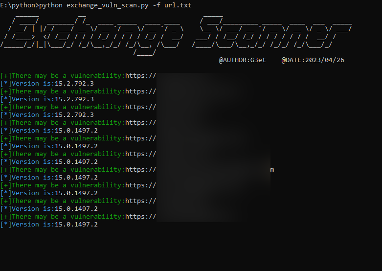

# ⭐说明：

## 🔍exchange_version.txt

📝exchange的完整版本包含漏洞版本里面，此脚本只针对proxylogon漏洞版本

## 🔍versions_safe.txt

📝除开了exchange的漏洞版本，含安全版本在内

## 🔍url.txt

📝这个文件可以自定义（自己准备），需要-f指向该文件，通过批量收集的url，请自行换行

## 🔍success.txt

📝符合漏洞版本的，将会自动生成success.txt


# ⭐注：

由于只添加了proxylogon相关的漏洞版本信息，如果遇到版本高于当前版本的可能就会出现误报，但是这种大版本跨越不是特别多，也就是说验证的成功率大概可以在92%以上，除此之外还可以添加proxyshell或其它的exchange相关的漏洞，只需要把受影响的大版本系列全部添加到exchange_version.txt然后再把确认有漏洞的版本删掉放入安全版本versions_safe.txt中就可以，这样就可以完成所有的漏洞检测


# ⭐用法：

```
git clone https://gitee.com/G3et/exchange_vuln_scan.git
cd exchange_vuln_scan
pip install -r requirements.txt
python3 exchange_vuln_scan.py -f url.txt
```





